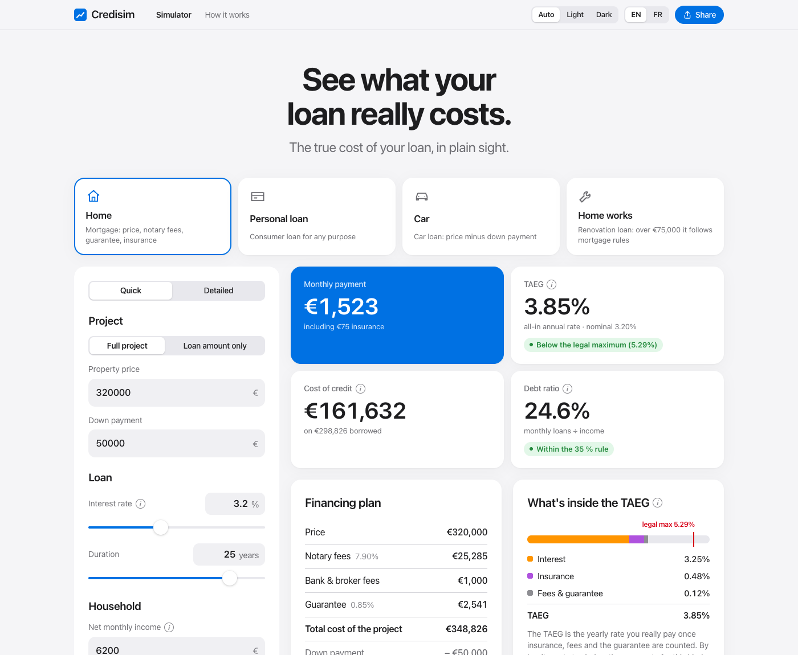
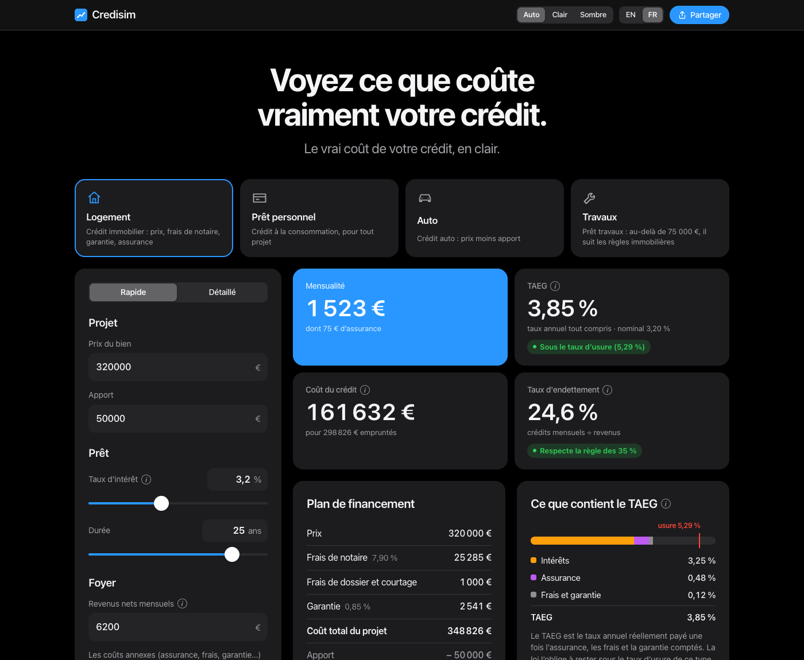
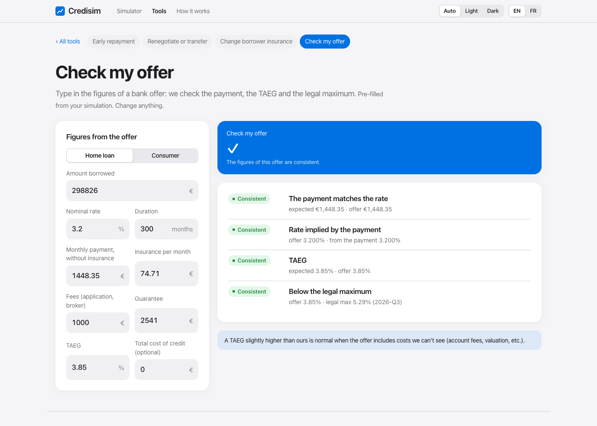
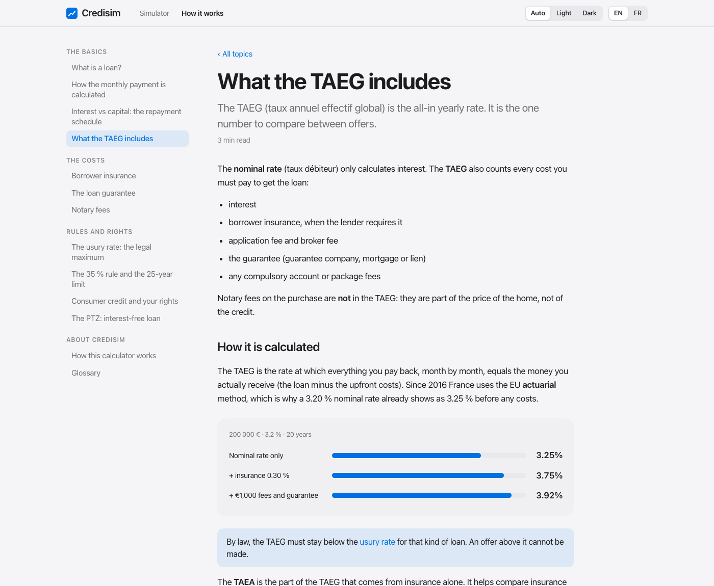

# Credisim

**The true cost of your loan, in plain sight.** / *Le vrai coût de votre crédit, en clair.*

Credisim is a neutral, bilingual (English / French) loan simulator for France, and later the rest of Europe. It shows the monthly payment, the **TAEG** (all-in rate) and the full cost of a loan, including borrower insurance, fees, the guarantee and notary costs. It also checks the result against the French legal limits: the usury rate and the HCSF 35 % / 25-year rules.

No sign-up, no sales call, and nothing leaves the browser: every calculation runs client-side.

| Light | Dark |
|---|---|
|  |  |

| Tools: check my offer | How it works |
|---|---|
|  |  |

## Features

- **Credit types:** home loan (mortgage), personal loan, car loan, home works loan. Each type has its own defaults, fields and legal-maximum band. A home loan can be simulated from the full project (price, down payment, notary fees) or from the **loan amount only** for a quick estimate.
- **Home-loan options:** fixed, variable or capped rate (Euribor + margin, index scenarios, yearly revision, worst case); constant payments, constant capital or in fine; partial or total deferral; two borrowers with their own insurance; **PTZ** with band check (2025–2027 rules), amount estimate and payment smoothing; money left each month.
- **Optional costs you can switch on or off:** borrower insurance (on the initial amount or the remaining balance, with coverage), guarantee (Crédit Logement-type guarantee, mortgage or lender's lien, estimated or entered by hand), notary fees (2026 regulated scale, département rate, first-time-buyer exemption, or a manual %), works, application fee, broker fee, other loans.
- **Results:**
  - monthly payment and cost of credit
  - TAEG and what it's made of, against the legal maximum for this loan
  - debt ratio and duration checks
  - financing plan and borrowing capacity
  - the same loan at other durations
  - repayment schedule by month or by year
- **Charts:** where the money goes, remaining balance, and what each year of payments covers.
- **Up to 4 scenarios** (A–D) compared side by side, differences vs A highlighted, all balance curves on one chart; **rate × duration grid** coloured by the 35 % rule and the legal maximum.
- **Tools (11):**
  - *Your home loan:* check my offer, early repayment, renegotiation / buy-out, borrower-insurance switch (loi Lemoine)
  - *Other credits:* revolving credit, pay in 3×/4× (real TAEG), car lease (LOA/LLD) vs loan, debt consolidation
  - *Property projects:* bridge loan, rental investment (yields and cash flow), rent or buy
- **Save, print, export:** save simulations in the browser, print a clean report or save it as PDF, export the schedule as CSV (Excel-ready in FR and EN).
- **Quick and Detailed modes**, and ⓘ explanations on every term.
- **Share links:** a short link (`/s/k7Pq2xZa`) made by the reusable [`packages/shortlink`](packages/shortlink) module (Firestore, EU); the address bar also keeps a compact, compressed copy of the simulation (`#c=…`).
- **How it works:** 23 short explainers in English and French (loans, monthly payment, schedule, repayment types and deferral, variable rates, TAEG, insurance, guarantee, notary fees, usury rate, 35 % rule, consumer rights, PTZ, checking an offer, early repayment, renegotiation, revolving credit and BNPL, car leasing, debt consolidation, bridge loans, rental investment, how the calculator works, glossary), with live examples. Every ⓘ links to the matching explainer.
- **English and French**, detected automatically. Light, dark or system theme. Responsive from phone to desktop.

The full list, with priorities, is in [docs/FEATURES.md](docs/FEATURES.md). What comes next is in [docs/ROADMAP.md](docs/ROADMAP.md).

## Getting started

Requires Node.js 20 or later (see `.nvmrc`). Copy `.env.example` to `.env.local` and add the Firebase web API key to enable short links (optional).

```bash
npm install
npm run dev        # dev server at http://localhost:5173
```

| Script | What it does |
|---|---|
| `npm run dev` | Start the dev server with hot reload |
| `npm test` | Run the engine and share-link tests (Vitest) |
| `npm run check` | Type-check TypeScript and Svelte (svelte-check) |
| `npm run build` | Build the static site into `dist/` |
| `npm run preview` | Serve the production build locally |
| `firebase deploy --only hosting` | Deploy by hand (tests and build run first) |

## Project structure

```
src/
  lib/engine/        Pure TypeScript calculation engine (no dependencies)
                     annuity & schedule, TAEG (EU actuarial method), usury bands,
                     notary scale, guarantee, PTZ, smoothing, deferral, variable rates,
                     tools (credits.ts, property.ts, tools.ts), capacity + tests
  lib/data/fr/       Versioned French regulatory data, each value with its source
  lib/i18n/          en.ts / fr.ts dictionaries, t(), number formatting, language detection
  lib/share.ts       Share payloads: compressed, validated, up to 4 scenarios (+ tests)
  lib/shortlinks.ts  App glue for short links (/s/<id>)
  lib/export.ts      CSV export and saved simulations (+ tests)
  lib/firebase/      Firebase config (Firestore, for short links)
  lib/analytics.ts   PostHog analytics (cookieless) + URL scrubbing (+ tests)
  lib/learn/         "How it works" articles (en.ts, fr.ts) + content tests
  lib/router.svelte.ts  Hash routes: simulator, #tools/<tool>, #learn/<topic>
  lib/state.svelte.ts  App state: credit type, mode, scenarios, theme
  components/        Svelte 5 UI; ui/ = controls, tools/ = Tools pages, learn/ = explainers and live examples
  app.css            Design tokens (light and dark)
docs/                Research, features, formulas, roadmap, naming, deployment
packages/shortlink/  Reusable short-link module (codec + Firestore store), its own README and tests
  planning/          Planning report and the Phase 0 prototype
```

## How the numbers are calculated

- **Monthly payment:** standard fixed-rate formula, with each line rounded to the cent like a bank schedule.
- **TAEG:** EU actuarial method (used in France since 2016). It solves for the rate at which the payments plus insurance equal the amount actually received (loan minus upfront fees and guarantee).
- **Notary fees:** transfer taxes, plus the regulated notary fee with VAT, plus the property-security contribution and disbursements.

Every formula is written out in [docs/CALCULATIONS.md](docs/CALCULATIONS.md), with the sources in [docs/RESEARCH.md](docs/RESEARCH.md).

## Regulatory data

French rates and rules live in `src/lib/data/fr/`:

| File | Contents | Refresh |
|---|---|---|
| `ptz.json` | PTZ bands, family coefficients, cost ceilings, shares, repayment terms (valid until 31 Dec 2027) | When the PTZ rules change |
| `usury.json` | Legal maximum rates (taux d'usure), one entry per quarter | Every quarter: 1 Jan, 1 Apr, 1 Jul, 1 Oct ([Banque de France](https://www.banque-france.fr/fr/statistiques/taux-et-cours)) |
| `rules.json` | HCSF limits, notary scale and transfer taxes, guarantee estimates | When the rules change |

When the latest quarter has expired, the app shows a "rates may be outdated" badge until a new entry is added. **Current data: Q3 2026, valid until 30 Sep 2026.**

## Language detection

The language is chosen in this order: `?lang=en|fr` → the visitor's saved choice → the country from the host (`window.__COUNTRY__`, to be filled from an edge/IP header) → browser language → French time zone → English.

## Deployment

Live at **https://creditsimulator.web.app** (Firebase project `credisimulator`, Hosting site `creditsimulator`).

- **Every push to `main`** runs the type check, tests and build, then deploys to the live site (`.github/workflows/firebase-hosting-merge.yml`).
- **Every pull request** gets the same checks and a temporary preview URL posted on the PR (`.github/workflows/firebase-hosting-pull-request.yml`).
- Deploys need the `FIREBASE_SERVICE_ACCOUNT_CREDISIMULATOR` repository secret, created once with `firebase init hosting:github`.
- Manual deploy: `firebase deploy --only hosting`.

Analytics: PostHog (EU cloud), cookieless like Suncast and Mont Valier, so there is no consent banner; it never receives simulation figures. See [docs/ANALYTICS.md](docs/ANALYTICS.md).

Step-by-step setup, caching and analytics details: [docs/DEPLOYMENT.md](docs/DEPLOYMENT.md).

## Disclaimer

Credisim gives estimates for information only. It is not a loan offer and does not replace the binding offer from a bank.

## License

[MIT](LICENSE)
